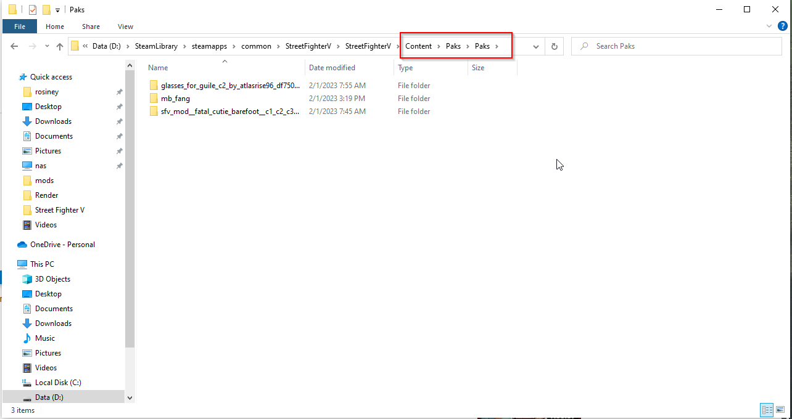

# Como instalar mods .pak SFV

Primeiro abra o diretório do jogo

Em seguida cria uma diretório com nome `Paks`, no seguinte caminho:

`<diretório_do_jogo>\Content\Paks`

E ficará da seguinte forma:

Após criar a diretório basta baixar os mods do tipo paks e extrair na diretório recentemente criada. É possível criar subspastas para manter a organização.

Os mods podem ser obtidos no seguinte endereço:

[https://www.deviantart.com/streetmodders/gallery/58269543/sfv-characters](https://www.deviantart.com/streetmodders/gallery/58269543/sfv-characters)

> Precisa criar conta no site para fazer os downloads.

Após o download basta extrair a imagem no diretório Paks, é necessário reabrir o game.

> Os arquivos listados como C1, C2, CN é referente a roupa que será alterada... no caso C1 irá trocar a roupa 1 do personagem, e caso o CN for de uma roupa que você não possuí, o mod não irá funcionar.